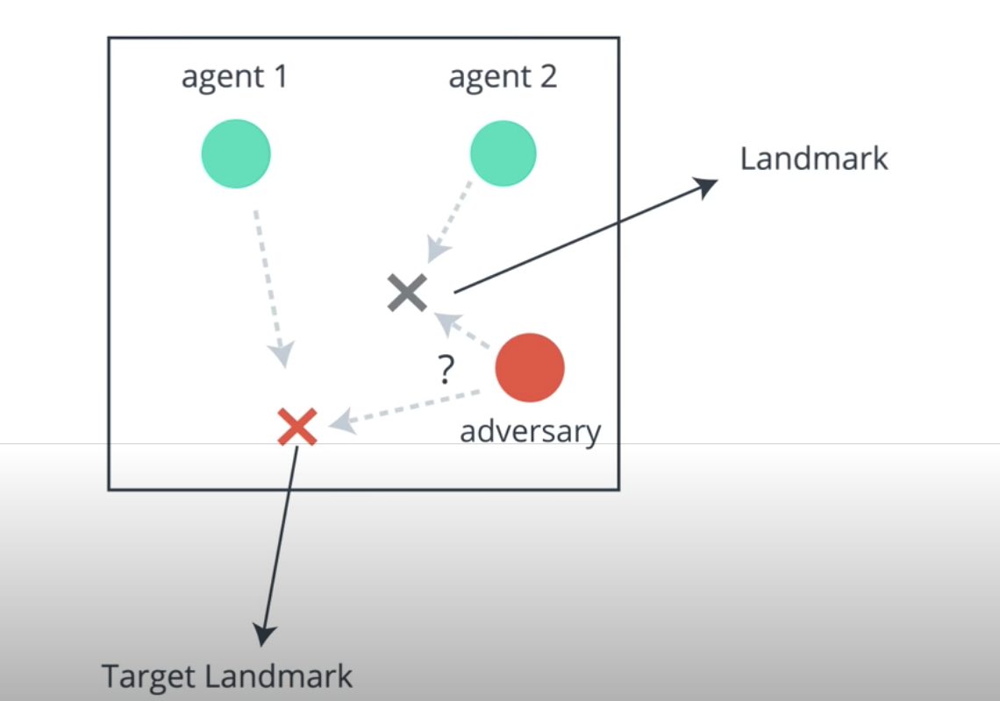
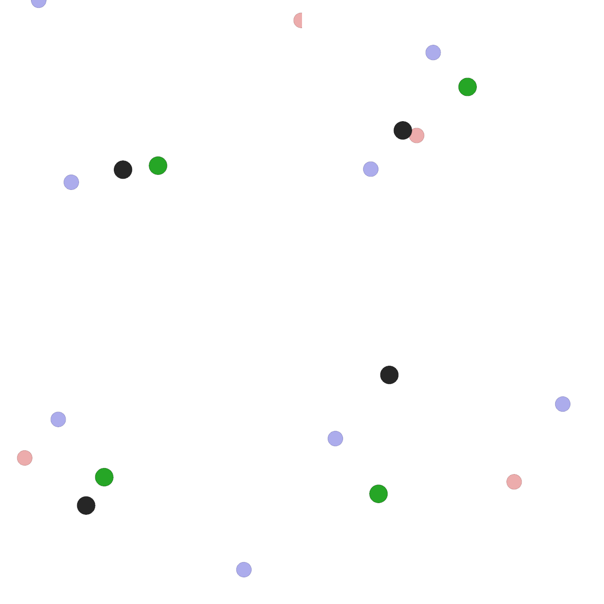

For this Lab, you will train an agent to solve the Physical Deception problem.

# Goal of the environment
Blue dots are the "good agents", and the Red dot is an "adversary". All of the agents' goals are to go near the green target. The blue agents know which one is green, but the Red agent is color-blind and does not know which target is green/black! The optimal solution is for the red agent to chase one of the blue agent, and for the blue agents to split up and go toward each of the target.

## Physical deception.
Here, N agents cooperate to reach a single target landmark from a total of N
landmarks. They are rewarded based on the minimum distance of any agent to the target (so only one
agent needs to reach the target landmark). However, a lone adversary also desires to reach the target
landmark; the catch is that the adversary does not know which of the landmarks is the correct one.
Thus the cooperating agents, who are penalized based on the adversary distance to the target, learn to
spread out and cover all landmarks so as to deceive the adversary

# Running within the workspace ( Recommended Option)
No explicit setup commands need to run by you, we have taken care of all the installations in this lab, enjoy exploration.
./run_training.sh Let's you run the program based on the parameters provided in the main program.
./run_tensorboard.sh will give you an URL to view the dashboard where you would have visualizations to see how your agents are performing. Use this as a guide to know how the changes you made are affecting the program.
Folder named Model_dir would store the episode-XXX.gif files which show the visualization on how your agent is performing.
Running on your own computer
If you choose to run the program on your computer, you should download the files from the workspace and all the above commands should work the same except for few installations below.
Use of GPU wouldn't impact the training time for this program, Instead, Multicore environments would be a better choice to increase the training speed.
## episode-0

## episode-996

## Requirements
OpenAI baselines, commit hash: 98257ef8c9bd23a24a330731ae54ed086d9ce4a7
PyTorch, version: 0.3.0.post4
OpenAI Gym, version: 0.9.4
Tensorboard, version: 0.4.0rc3 and Tensorboard-Pytorch, version: 1.0 (for logging)
# To Experiment
Feel free to clear the model_dir and log folder and start training on your own to see how your agent performs. ./clean.sh should help you accomplish this goal.
This lab is meant to prepare you for the final project, writing your own functions in maddpg.py will improve your learning curve.
Also experiment with parameter tuning in main.py, Make note that a larger number of episodes would mean greater training time.
Lab might take more than one hour to train depending on how the parameters are tuned.

## Original README

1. To run the code, please use the command "./run_training.sh". The bash script cleans up and DELETE previous runs. The script is necessary because we need an extra command to ensure image rendering is possible remotely. Training takes about two hour. If you run locally on your own computer. Be sure to increase the number of parallel agents to the number of cores your computer have in main.py. GPU does not help that much in the computation.

2. To see a visualization of the results, run the script "./run_tensorboard.sh". A link will appear, and direct your browser to that link to see rewards over time and other statistics

3. The trained models are stored in "model_dir" by default. You can also find .gif animations that show how the agents are performing! The gif file contains a grid of separate parallel agents.

4. To understand the goal of the environment: blue dots are the "good agents", and the Red dot is an "adversary". All of the agents' goals are to go near the green target. The blue agents know which one is green, but the Red agent is color-blind and does not know which target is green/black! The optimal solution is for the red agent to chase one of the blue agent, and for the blue agents to split up and go toward each of the target.

Feel free to clear the model_dir and log folder and start training on your own to see how your agent performs. ./clean.sh should help you accomplish this goal.
This lab is meant to prepare you for the final project, writing your own functions in maddpg.py will improve your learning curve.
Also experiment with parameter tuning in main.py, Make note that a larger number of episodes would mean greater training time.
Lab might take more than one hour to train depending on how the parameters are tuned.
