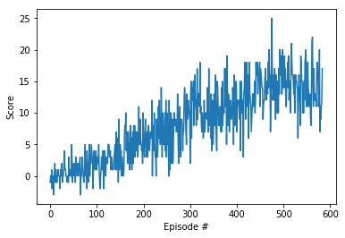

## DQN Implementation
Open the file named [Navigation.ipynb](./Navigation.ipynb) to see codes and outputs.

It uses a simple DQN algorithm including:
TD learning: with every action take given a state, use the reward and value estimation of next state to estimate current state's value. Future reward is discounted by GAMMA=0.99 per timestep.
- it uses neural network model as function approximator to estimate the value for all actions in a given states. The neural network has two hidden layers, each of dize 64. The final output layer is of the same size of the action space.
    - Network use MSE as loss function.
    - Adam optimizer is used with learning rate=5e-4
- the RL algorithm used is Q-learning.
- to improve performance, it uses two separate networks, one act as fixed target network that is updated every 4 steps (UPDATE_EVERY=4), the other network is updated with gradient descent on every batch
- it also applies experience replay: when the agent interact with the environment, instead of using the experience immediately, it saves the experience sample into a buffer. After gathering BATCH_SIZE=64 experiences, the algorithm then use a few samples from the buffer to train neural networks. This way, it decouples the correlation caused by adjacent experiences.

## Results
- Here is the plot for average score per episode during the agent training process. It uses 484 episodes to reach the goal of over 13 for 100 episodes.

- The file named [checkpoint1.pth](./heckpoint1.pth) in this repo saved model weights of successful trained agent.

## Future improvements
There are variations in DQN that can perform better than the current approach, including:
- Double Q-Learning :[Paper](https://arxiv.org/abs/1509.06461)
- Prioritized Experience Replay :[Paper](https://arxiv.org/abs/1511.05952)
- [Dueling Network Architectures for Deep Reinforcement Learning](https://arxiv.org/abs/1511.06581)
