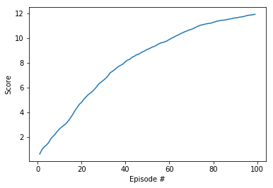
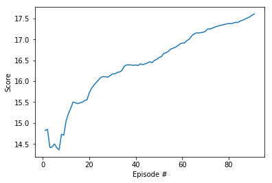
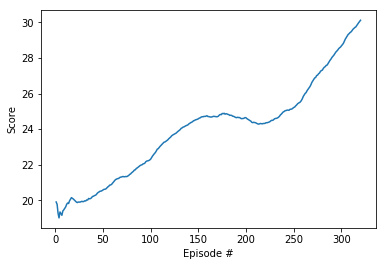
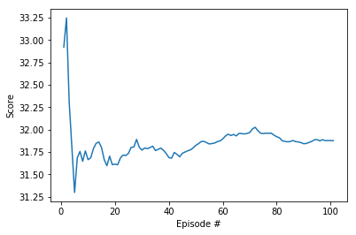

## Review Suggestions
- The recent achievement of the Open AI group to play [Dota 2](https://openai.com/blog/dota-2/) using Reinforcement Learning is a must read
- An effective way to improve the performance of DDPG is by using Prioritized Experience Replay. You should check this github [repo](https://github.com/rlcode/per) for a fast implementation of Prioritized Experience Replay using a special data structure Sum Tree.

Below is a comparison of DDPG with random sampling vs DDPG with PER for the Reacher environment. It's quite evident how episode variation decreased and performance improved.

- Following posts give an insight into some other reinforcement learning algorithms that can be used to solve the environment.

- [Proximal Policy Optimization by Open AI](https://openai.com/blog/openai-baselines-ppo/)
- [Introduction to Various Reinforcement Learning Algorithms. Part II (TRPO, PPO)](https://towardsdatascience.com/introduction-to-various-reinforcement-learning-algorithms-part-ii-trpo-ppo-87f2c5919bb9)

## Implementation
An DDPG RL agent is implemented to solve the continous environment.
It is an actor-critic approach where:
- The actor takes as input the state and outputs the best action. It essentially controls how the agent behaves by learning the optimal policy (policy-based).
- The critic, on the other hand, evaluates the action by computing the value function (value based).
- Both actor and critic is implemented by means of a neural network. They both get better in their own role. The result is that they learn to play the game more efficiently than the two methods separately.

Read this [paper](https://arxiv.org/abs/1509.02971) for more details.
The original paper used
  1. replay buffer
  2. target network
  3. soft update
  3\4. batch normalization

In this implementation, I only have 1,2,3, without 4 it is also able to solve the environment.
The environemnt has  20 identical agents, each with its own copy of the environment. At every time step, the all 20 agents' experience are saved into replay buffer, and a batch of experiense are sampled randomly from replay buffer to practice learning and soft update the target network weights

### Hyper Parameters
```
BUFFER_SIZE = int(1e6)  # replay buffer size
BATCH_SIZE = 64         # minibatch size
GAMMA = 0.99            # discount factor
TAU = 1e-3              # for soft update of target parameters
LR_ACTOR = 1e-4         # learning rate of the actor
LR_CRITIC = 1e-3         # learning rate of the critic
WEIGHT_DECAY = 0   # L2 weight decay
```
### Network Architectures
Critic:
```
input layer: 33(state size) => 256
1st hidden layer: 256+4 => 256
2nd hidden layer: 256 => 128
Output layer: 128 => 1
```
Actor:
```
input layer: 33(state size) => 256
output layer: 256 => 4 (action size)
```
## Results
It took 511 episodes to train the agent to reach score over 30 .I also used another 101 episodes to verify it solves the environemnt.
- I splitted training into 3 phases, this is because training takes so long and I can't finish training within one try. SO I loaded checkpoint from last phase to resume training. Here is the plot for three phases:




- This is the plot for the 100 verification episodes.



NOTE: I resumed training so this plot only does not include the initial learning (from reward 0).

In this folder, you can find the saved actor and critic checkpoints as well:
- [checkpoint_actor_5_24.pth](./checkpoint_actor_5_24.pth)
- [checkpoint_critic_5_24.pth](./checkpoint_critic_5_24.pth)

## Ideas for Future Work
1. implementat batch nomalization as in the original paper
2. add drop out to reduce overfitting
3. implement [D4PG](https://openreview.net/forum?id=SyZipzbCb) algorithm
