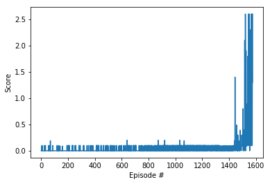

# Learning Algorithm

The learning algorithm used is MADDPG- Multi-agent version of DDPG
Original paper - [Multi-Agent Actor-Critic for Mixed Cooperative-Competitive Environments](https://papers.nips.cc/paper/7217-multi-agent-actor-critic-for-mixed-cooperative-competitive-environments.pdf)

In summary: it is using the framework of **centralized training with decentralized execution**, allowing the policies
to use extra information to ease training, so long as this information is not used at test time. It is an extension of actor-critic policy gradient methods where the critic is
augmented with extra information about the policies of other agents, while the actor only has access
to local information. After training is completed, only the local actors are used at execution phase,
acting in a decentralized manner and equally applicable in cooperative and competitive settings. This
is a natural setting for multi-agent language learning, as full centralization would not require the
development of discrete communication protocols.


# hyperparameters
```
BUFFER_SIZE = int(1e6)  # replay buffer size
BATCH_SIZE = 256         # minibatch size
GAMMA = 0.99            # discount factor
TAU = 1e-2              # for soft update of target parameters
LR_ACTOR =  2e-4        # learning rate of the actor
LR_CRITIC = 1e-3
OUNoise sigma=0.5
start noise scale=5
noise reduction factor=0.9999
min noise scale=0.001
```
# model architectures for any neural networks.
- Actor has two hidden layers: 24(state_size) -> 512 -> 256 -> 2(action size)
  - with 0.2 dropout in hidden layers
- Critic has two hidden layers: 52 (state_size+action_size)*2 -> 512 -> 256 -> 1


 Saved networks weights can be found in:
 - [actor1](./checkpoint_actor1_6_11_train_v2.pth)
 - [actor2](./checkpoint_actor2_6_11_train_v2.pth)
 - [critic1](./checkpoint_critic1_6_11_train_v2.pth)
 - [critic2](./checkpoint_critic2_6_11_train_v2.pth)

# Plot of Rewards
I solved the environment with 1575 episodes, at one point the max score achieve 2.6
Here is the plot of rewards per episode, it shows the agents get an average score of +0.5 (over 100 consecutive episodes, after taking the maximum over both agents):




# Ideas for Future Work
To improve agent's performance, the following ideas can be explored:
1. Optimize neural network, with more layers and hyper parameters tuning
2. Try different loss functions, currently using huberloss
3. Instead of using a simple memory queue, use prioritized experience replay
